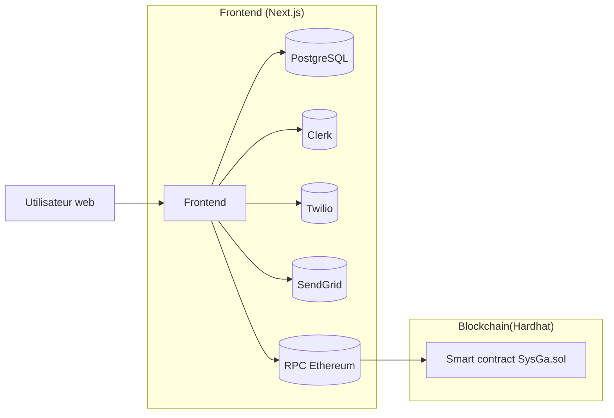

# 🚀 SYSGA - Guide Complet de Déploiement

> **Système de Gestion d'Assurance basé sur la Blockchain**

## 📋 Vue d'ensemble

SYSGA est une application d'assurance décentralisée qui permet de gérer et tracer les cartes d'assurance sur la blockchain Ethereum.

### 🏗️ Architecture

```
┌─────────────────┐    ┌─────────────────┐    ┌─────────────────┐
│   Frontend      │    │   Smart         │    │   Base de       │
│   (Next.js)     │◄──►│   Contract      │◄──►│   données       │
│   Port 3000     │    │   (Ethereum)    │    │   (PostgreSQL)  │
└─────────────────┘    └─────────────────┘    └─────────────────┘
```

### Diagramme des modules



## 🎯 Environnements de Déploiement

### 🔧 **Développement Local** (Recommandé pour commencer)

- **Blockchain** : Hardhat (localhost)
- **Frontend** : Next.js (localhost:3000)
- **Base de données** : PostgreSQL (Docker)
- **Coût** : Gratuit

### 🌐 **Production** (Beta testeurs)

- **Blockchain** : Sepolia (testnet)
- **Frontend** : Vercel
- **Base de données** : PostgreSQL (Vercel)
- **Coût** : Gratuit (ETH de test)

### 🚀 **Production Finale**

- **Blockchain** : Ethereum mainnet
- **Frontend** : Vercel
- **Base de données** : PostgreSQL (Vercel)
- **Coût** : ~0.03 ETH

---

## 🛠️ Développement Local

### Prérequis

- [Docker](https://www.docker.com/products/docker-desktop) installé
- [Docker Compose](https://docs.docker.com/compose/) (inclus dans Docker Desktop)
- [Node.js](https://nodejs.org/) (v18+)

### 🚀 Lancement rapide

1. **Cloner le projet** :

   ```bash
   git clone <repo-url>
   cd SYSGA
   ```

2. **Lancer l'application complète** :

   ```bash
   docker-compose up
   ```

3. **Accéder aux services** :
   - **Frontend** : [http://localhost:3000](http://localhost:3000)
   - **Blockchain locale** : `http://localhost:8545`
   - **Base de données** : `localhost:5432`

### 📝 Commandes utiles

```bash
# Arrêter l'application
docker-compose down

# Lancer les tests
docker-compose run backend npx hardhat test

# Déployer le contrat localement
docker-compose run backend npx hardhat ignition deploy ./ignition/modules/SysGa.js

# Voir les logs
docker-compose logs -f
```

### 🔧 Développement

- **Hot reload** : Les modifications frontend sont prises en compte automatiquement
- **Smart contracts** : Relancer le service backend après modification des contrats
- **Base de données** : Les données persistent dans le volume Docker

---

## 🌐 Déploiement en Production

### 📋 Prérequis

1. **Wallet Ethereum** avec des fonds
2. **Comptes API** (Infura, Etherscan)
3. **Compte Vercel** pour le frontend

### 🔑 Configuration des Services

#### A. Infura (RPC Provider)

1. Aller sur [infura.io](https://infura.io)
2. Créer un compte et un projet
3. Récupérer les URLs RPC :
   - Sepolia : `https://sepolia.infura.io/v3/YOUR-PROJECT-ID`
   - Mainnet : `https://mainnet.infura.io/v3/YOUR-PROJECT-ID`

#### B. Etherscan (Vérification des contrats)

1. Aller sur [etherscan.io](https://etherscan.io)
2. Créer un compte et générer une clé API

#### C. ETH de test (Sepolia)

1. Aller sur [sepoliafaucet.com](https://sepoliafaucet.com)
2. Coller votre adresse wallet
3. Recevoir des ETH de test

### ⚙️ Configuration Backend

1. **Créer le fichier .env** :

   ```bash
   cd backend
   cp env.example .env
   ```

2. **Configurer .env** :

   ```env
   # Clé privée du wallet (⚠️ IMPORTANT: Ne jamais commiter)
   PRIVATE_KEY=votre_clé_privée_ici

   # URLs RPC Infura
   SEPOLIA_RPC_URL=https://sepolia.infura.io/v3/YOUR-PROJECT-ID
   MAINNET_RPC_URL=https://mainnet.infura.io/v3/YOUR-PROJECT-ID

   # Clés API
   ETHERSCAN_API_KEY=votre_clé_etherscan
   ```

### 🚀 Déploiement du Smart Contract

#### Testnet (Sepolia) - Recommandé pour les beta testeurs

```bash
cd backend

# Vérifier la balance
npm run check-balance --network sepolia

# Déployer le contrat
npm run deploy:sepolia

# Vérifier le déploiement
npm run verify:sepolia
```

#### Mainnet (Production finale)

```bash
cd backend

# Déployer le contrat
npm run deploy:mainnet

# Vérifier le déploiement
npm run verify:mainnet
```

### ⚙️ Configuration Frontend

1. **Mettre à jour la configuration blockchain** :

   ```javascript
   // frontend/constants/blockchain.js
   sepolia: {
     chainId: 11155111,
     name: "Sepolia",
     rpcUrl: "https://sepolia.infura.io/v3/YOUR-PROJECT-ID",
     explorer: "https://sepolia.etherscan.io",
     contractAddress: "0xVOTRE_ADRESSE_DEPLOYEE" // À remplacer
   }
   ```

2. **Configurer les variables d'environnement** :
   ```env
   # frontend/.env.local
   NEXT_PUBLIC_INFURA_PROJECT_ID=your_project_id
   NEXT_PUBLIC_CONTRACT_ADDRESS=0xVOTRE_ADRESSE_DEPLOYEE
   NEXT_PUBLIC_DEFAULT_NETWORK=sepolia
   ```

### 🚀 Déploiement Frontend

```bash
# Commit des changements
git add .
git commit -m "Configure blockchain deployment"
git push origin main

# Vercel déploiera automatiquement
```

---

## 🔧 Scripts Disponibles

### Backend

| Script                   | Description                      |
| ------------------------ | -------------------------------- |
| `npm run deploy:sepolia` | Déploiement sur Sepolia          |
| `npm run deploy:mainnet` | Déploiement sur Ethereum mainnet |
| `npm run verify:sepolia` | Vérification sur Sepolia         |
| `npm run check-balance`  | Vérifier la balance du wallet    |
| `npm run interact`       | Interagir avec le contrat        |

### Frontend

| Script          | Description            |
| --------------- | ---------------------- |
| `npm run dev`   | Développement local    |
| `npm run build` | Build de production    |
| `npm run start` | Démarrer en production |

---

## 🧪 Instructions pour les Beta Testeurs

### Prérequis

1. **Installer MetaMask** : [metamask.io](https://metamask.io)
2. **Ajouter le réseau Sepolia** dans MetaMask :
   - Nom : Sepolia
   - RPC URL : `https://sepolia.infura.io/v3/YOUR-PROJECT-ID`
   - Chain ID : 11155111
   - Explorer : `https://sepolia.etherscan.io`
3. **Obtenir des ETH de test** : [sepoliafaucet.com](https://sepoliafaucet.com)

### Test de l'application

1. **Se connecter** à l'application avec MetaMask
2. **Vérifier la connexion** au contrat
3. **Tester les fonctionnalités** :
   - Lecture des cartes d'assurance
   - Ajout d'une nouvelle carte
   - Changement de réseau

---

## 📊 Monitoring et Explorers

### Explorers de contrats

- **Sepolia** : [sepolia.etherscan.io](https://sepolia.etherscan.io)
- **Mainnet** : [etherscan.io](https://etherscan.io)

### Métriques importantes

- **Adresse du contrat déployé**
- **Nombre de transactions**
- **Gas utilisé**
- **Balance du wallet de déploiement**

---

## 🚨 Gestion des Erreurs

### Erreurs communes

1. **"Insufficient funds"** → Obtenir des ETH de test
2. **"Wrong network"** → Basculer vers Sepolia
3. **"Contract not found"** → Vérifier l'adresse du contrat
4. **"RPC error"** → Vérifier les URLs RPC

### Support

- Vérifier les logs de déploiement
- Consulter l'explorer de contrats
- Tester d'abord en local : `npx hardhat node`

---

## 💰 Coûts Estimés

| Environnement     | Déploiement | Vérification | Total     |
| ----------------- | ----------- | ------------ | --------- |
| **Développement** | Gratuit     | Gratuit      | Gratuit   |
| **Sepolia**       | Gratuit     | Gratuit      | Gratuit   |
| **Mainnet**       | ~0.02 ETH   | ~0.01 ETH    | ~0.03 ETH |

---

## 🔒 Sécurité

⚠️ **IMPORTANT** :

- Ne jamais commiter votre clé privée
- Utiliser un wallet dédié pour le déploiement
- Tester d'abord sur testnet
- Sauvegarder l'adresse du contrat déployé
- Utiliser des variables d'environnement

---

## 📁 Structure du Projet

```
SYSGA/
├── backend/                 # Smart contracts, Hardhat
│   ├── contracts/          # Contrats Solidity
│   ├── scripts/           # Scripts de déploiement
│   └── ignition/          # Modules de déploiement
├── frontend/              # Application Next.js
│   ├── app/              # Pages et composants
│   ├── components/       # Composants React
│   └── constants/        # Configuration blockchain
├── docker-compose.yml    # Orchestration Docker
└── README.md            # Ce fichier
```

---

## 🎯 Workflow Recommandé

### 1. **Développement** (Local)

```bash
docker-compose up --build
# Développer et tester en local
```

### 2. **Testnet** (Beta testeurs)

```bash
# Déployer sur Sepolia
npm run deploy:sepolia
# Configurer le frontend
# Déployer sur Vercel
```

### 3. **Production** (Final)

```bash
# Déployer sur mainnet
npm run deploy:mainnet
# Mettre à jour la configuration
# Déployer sur Vercel
```

---

## 📞 Support

En cas de problème :

1. Vérifier les logs de déploiement
2. Consulter la documentation Hardhat
3. Vérifier la configuration des services
4. Tester en local avant de déployer

---

**🎉 Félicitations !** Votre application SYSGA est maintenant prête pour le déploiement !
